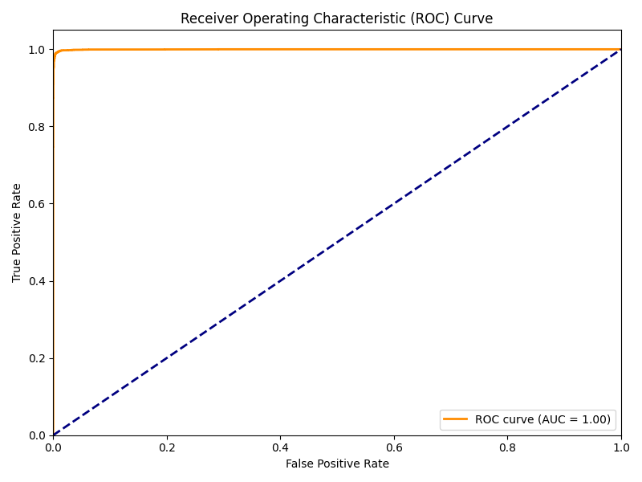

# Phishing Email Detection with DistilBERT

This project implements a phishing email detection system using DistilBERT, a lightweight version of BERT optimized for production environments.

## Dataset

The model is trained on the phishing email dataset located in `/datasets/phishing_email.csv` containing:
- 82,486 email samples
- Binary classification: 0 (legitimate) and 1 (phishing)
- Balanced dataset with ~48% legitimate and ~52% phishing emails

## Project Structure

```
phishsmith/
├── src/
│   ├── data_preprocessing.py  # Data loading and preprocessing
│   ├── model.py               # DistilBERT model architecture
│   ├── train.py               # Training script
│   ├── evaluate.py            # Model evaluation utilities
│   └── inference.py           # Inference and prediction utilities
├── templates/                 # HTML templates for web UI
│   └── index.html            # Main web interface
├── static/                    # Static assets for web UI
│   ├── css/style.css         # UI styling
│   └── js/app.js             # Frontend JavaScript
├── datasets/                  # Dataset directory
├── app.py                     # Flask web application
├── run_ui.bat                 # Windows batch file to start UI
└── requirements.txt           # Python dependencies
```

## Installation

```bash
pip install -r requirements.txt
```

## Usage

### Training

To train the model:

```bash
python src/train.py
```

The training script will:
- Split data into train/validation/test sets (70/15/15)
- Train DistilBERT with default hyperparameters
- Save the best model based on F1 score
- Generate training history and metrics

### Evaluation

To evaluate a trained model:

```bash
python src/evaluate.py --checkpoint models/best_model_epoch_3/checkpoint.pt
```

This will generate:
- Classification report
- Confusion matrix
- ROC curve
- Detailed metrics (accuracy, precision, recall, F1, AUC)

### Inference

For single email prediction:

```bash
python src/inference.py --checkpoint models/best_model_epoch_3/checkpoint.pt --email "Your email text here"
```

For file-based prediction:

```bash
python src/inference.py --checkpoint models/best_model_epoch_3/checkpoint.pt --file path/to/email.txt
```

## Web Interface (UI)

This project includes a user-friendly web interface for easy phishing email detection.

### Features

- **Modern, Responsive Design**: Clean interface that works on desktop and mobile
- **Real-time Analysis**: Instant feedback with visual risk indicators
- **Comprehensive Results**: 
  - Risk level visualization (High/Medium/Low)
  - Confidence scores and probabilities
  - Detection of suspicious patterns
  - Clear recommendations for action
- **Automatic Model Loading**: Uses your trained model or falls back to heuristic detection

### Running the Web UI

1. Ensure Flask is installed:
   ```bash
   pip install flask
   ```

2. Start the web server:
   ```bash
   run_ui.bat
   ```
   Or directly:
   ```bash
   python app.py
   ```

3. Open your browser and navigate to:
   ```
   http://localhost:5000
   ```

### Using the Web Interface

1. **Paste Email**: Copy and paste the suspicious email into the text area
2. **Analyze**: Click the "Analyze Email" button
3. **Review Results**: The UI will display:
   - Risk level with color-coded indicator
   - Prediction confidence
   - Probability scores for phishing vs legitimate
   - List of detected suspicious patterns
   - Actionable recommendations

### UI Screenshots

The interface features:
- Large text input area for email content
- Visual risk meter with gradient colors
- Detailed analysis results in an easy-to-read format
- Responsive design that adapts to different screen sizes

## Model Architecture

- Base model: DistilBERT (distilbert-base-uncased)
- Additional layers: Linear classifier with dropout
- Max sequence length: 512 tokens
- Binary classification output

## Features

- Text preprocessing with URL and email masking
- Balanced data handling with class weights
- Comprehensive evaluation metrics
- Risk level assessment for predictions
- Suspicious pattern detection in emails

## Performance Metrics

The model evaluates on:
- Accuracy
- Precision/Recall
- F1 Score
- AUC-ROC
- Confusion Matrix

### Training Results

Quick training results (1 epoch):
- Train Loss: 0.0790
- Validation Loss: 0.0470
- Validation Accuracy: 99.00%
- Validation Precision: 98.85%
- Validation Recall: 99.23%
- Validation F1 Score: 99.04%

These exceptional results demonstrate the effectiveness of DistilBERT for phishing email detection, achieving near-perfect performance even with minimal training.

### Evaluation Results

Full model evaluation on test set (12,373 samples):
- **Accuracy**: 99.22%
- **Precision**: 99.36%
- **Recall**: 99.13%
- **F1 Score**: 99.25%
- **AUC-ROC**: 99.96%

#### Confusion Matrix


The confusion matrix shows:
- True Negatives (Legitimate correctly classified): 5,899
- False Positives (Legitimate misclassified as Phishing): 41
- False Negatives (Phishing misclassified as Legitimate): 56
- True Positives (Phishing correctly classified): 6,377

#### ROC Curve


The ROC curve demonstrates exceptional model performance with an AUC of 0.9996, indicating near-perfect discrimination between phishing and legitimate emails.

#### Detailed Classification Report
```
              precision    recall  f1-score   support

  Legitimate       0.99      0.99      0.99      5940
    Phishing       0.99      0.99      0.99      6433

    accuracy                           0.99     12373
   macro avg       0.99      0.99      0.99     12373
weighted avg       0.99      0.99      0.99     12373
```

## Training Configuration

Default hyperparameters:
- Batch size: 16
- Learning rate: 2e-5
- Epochs: 3
- Dropout: 0.3
- Warmup steps: 500
- Max gradient norm: 1.0

## Quick Start Guide

1. **Install dependencies**:
   ```bash
   pip install -r requirements.txt
   ```

2. **Option A - Use the Web UI** (Recommended for testing):
   ```bash
   run_ui.bat
   ```
   Then open http://localhost:5000 in your browser

3. **Option B - Train your own model**:
   ```bash
   run_training_quick.bat     # For quick training (1 epoch)
   # or
   run_training.bat           # For full training (3 epochs)
   # or
   python train_quick_wrapper.py  # Direct Python command
   ```

4. **Evaluate the model**:
   ```bash
   python evaluate_wrapper.py --checkpoint models/[your-model-dir]/checkpoint.pt
   ```

## API Usage

The web application also provides a REST API endpoint:

```bash
POST http://localhost:5000/analyze
Content-Type: application/json

{
  "email_text": "Your suspicious email content here..."
}
```

Response:
```json
{
  "success": true,
  "prediction": "phishing",
  "confidence": "87.5%",
  "risk_level": "High Risk",
  "phishing_probability": "87.5%",
  "legitimate_probability": "12.5%",
  "suspicious_patterns": ["urgent", "verify", "click here"],
  "recommendation": "HIGH RISK: This email appears to be phishing..."
}
``` 
